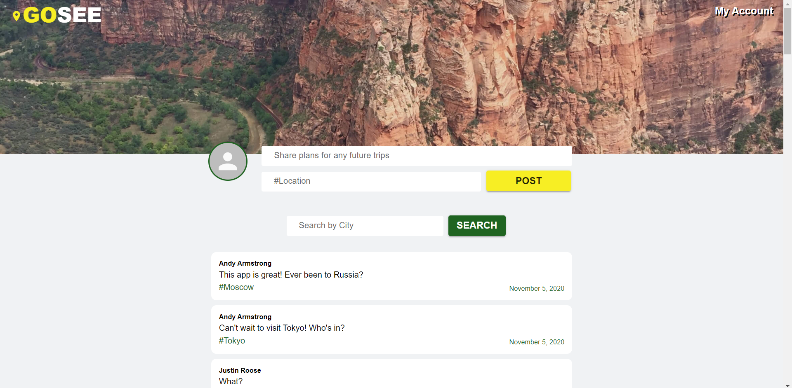

# **_GoSEE_**

## **License**

MIT

## **Description**

This group project was to create a full stack application with Reactjs as the front end. We wanted to build a social traveling app that allows users from around the world to meet, talk about locations to travel to, and even plan trips together! Our MVP allows users to create an account and post to a main feed that all users can see and respond to! Deployed Heroku can be found at https://go-see.herokuapp.com/

## **Pipeline Ideas**

- Show other users' information
- Profile Page
  – Update information
- Chat function
- API’s for planning your trip –- hotel/airline
- API's for location information -- things to do, notable places to visit

## **Collaborators**

- [Michael Gragg](https://github.com/mdgragg)
- [Josh Panakkal](https://github.com/jpanakkal22)
- [Justin Roose](https//github.com/jdouglasr)

### **Installation**

Installation: You will need to have Node installed and then run `npm install` to install dependencies. To run the program locally, you can either install [Nodemon](https://nodemon.io/) or just run `node server.js`. After this step, open your browser and navigate to `localhost:3001`. This should display the app.

### **Image**

Landing Page:

Home Page:

### **Contributing**

Pull requests are welcome. For major changes, please open an issue first to discuss what you would like to change.

### **Tests**

There are no tests currently. Please make sure to update tests as appropriate.

### **Questions**

- _For further information or questions, find us on Github through our links under
  **Collaborators**!_
